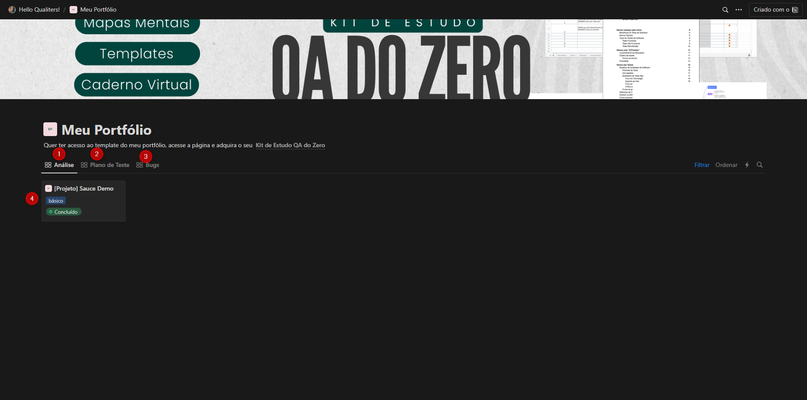
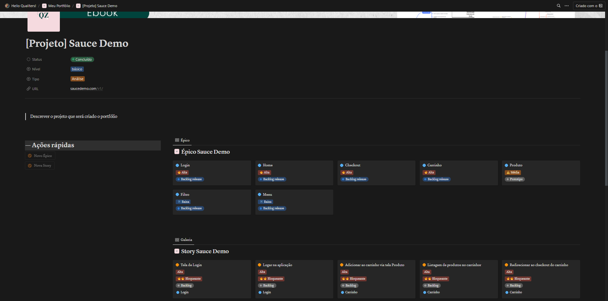
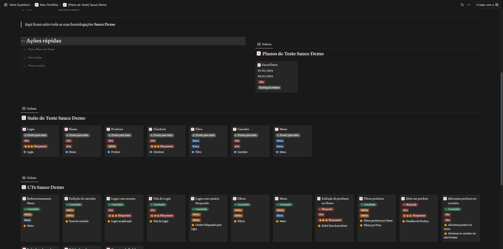
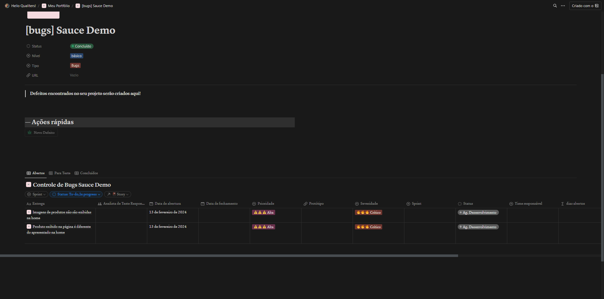

# Análise, Plano de Teste, Execução e Abertura de Defeito

### Como foi configurado o projeto

- Template Notion: O template do projeto do Notion com analise, plano de teste, execução e abertura de defeitos pode ser adquirido pelo link [Kit de Estudo QA do Zero](https://priscilacaimi.notion.site/Kit-de-Estudo-QA-do-Zero-5d619cbbe23749818d6bb8cdbfa5f1ec)

- O template se divide basicamente em 4 partes: 

    1: Base de dados Análise de Projeto

    2: Base de dados do Plano de Teste e Execução

    3: Base de dados de abertura de Bugs

    4: Exibição dos filtros 

- Visual da Analise de Projetos: aqui são divididos em Épicos e Story

- Visual do Plano de Teste: com os Planos, Suites e CTs criados

- Visual das Execuções: com a lista de CTs vinculados a execução

- Visual Gerenciamento de Bugs: com a lista de bugs abertos

### Veja o Projeto

- [Projeto Sauce Demo](https://priscilacaimi.notion.site/8294974997d6440c8e4bf86551465efd?v=5cdd8975320c4107a52df19c7b5b77a1)

## Entre em contato 

email: priscila.caimi@hotmail.com

redes socias: https://linktr.ee/priscilacaimi